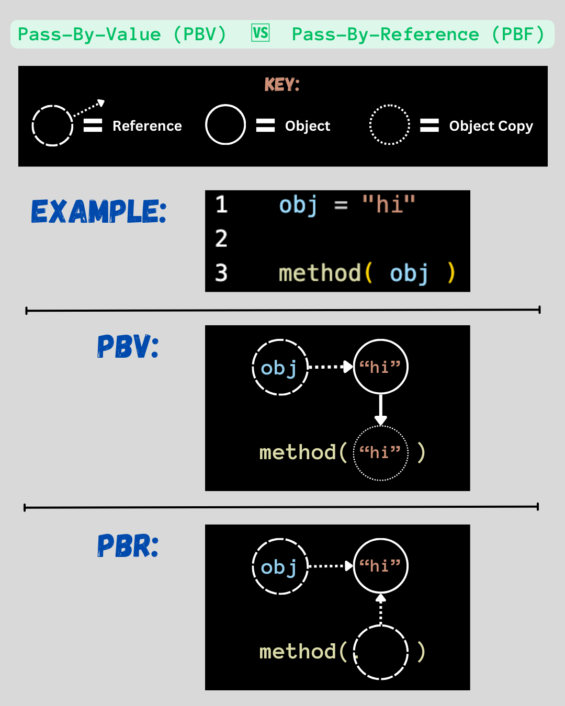
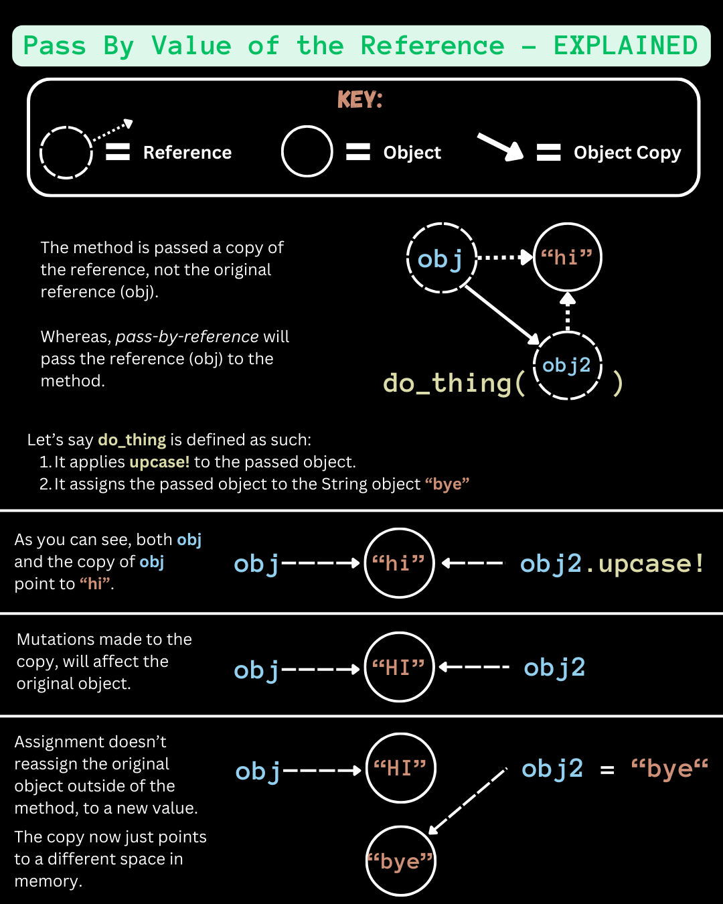
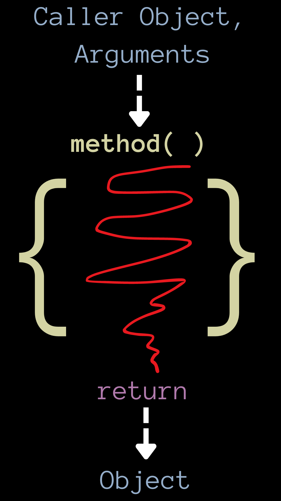
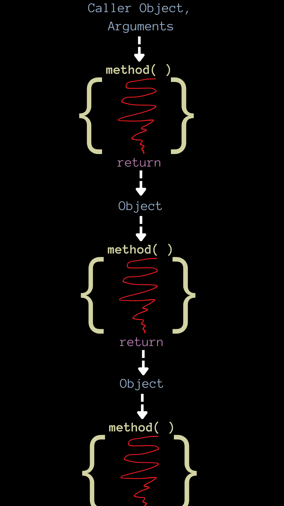

# <ins>Pass by Reference 🆚 Pass by Value</ins>
> A widely debated topic amongst Rubyist. 
> Is Ruby _pass by reference (PBR)_ or _pass by value (PBV)_?
> A debate on what Ruby does under the hood when passing objects to methods.
> Are objects passed to methods _references_ to that object in memory, or are they _copies_ of that object?

### Starting Terms & Vocab:

- #### "_Pass By Value_"
> In context to this term, _value_ represents a copy of an object. The value of an object is a copy of the object.

<br>

- #### "_Pass By Reference_"
> In context to this lesson, _reference_ represent a reference/pointer to a spot in memory where an object resides. It's not a copy of the object, it's a direct reference. 

<br>

#### Here's an image to help illustrate the difference between the two:
<br>




<hr>

## Case for "Pass by Value"

Some Rubyist will argue that Ruby is a pass-by-value language.

Because when you pass an object to a method and try to reassign its value within the method definition, it doesn't actually change the value of that object in the outer scope.

<br>

_**Example :**_
```ruby
def change_object(obj)
  obj = 25
end 

obj = 100

puts obj #=> 100

change_object(obj) 

puts obj #=> 100

```
> In the above code snippet, you can see that even though we passed `obj` to the `change_object` method
> and reassigned its value within `change_object`'s definition, when we reference  `obj` after invoking
> `change_object` we still get the value of `100` for `obj`.

<br>

This leads us to belive that we are passing _'values'_ (copies) of an object to a method and not actually changing the object that exists in the outer scope.

<hr>

## Case for "Pass by Reference"

But if Ruby was purely _"pass by value"_ then we shouldn't be able to mutate or modify variables passed to methods.

This is because the variables we pass would supposedly be copies of the original object.

Therefore, we wouldn't be modifying or mutating the original object, we'd be mutating/modifying the copy of the object.

<br>

_**So why does this work then?? :**_
```ruby
def change_object(obj)
  obj.upcase!
end

obj = "joe"
puts obj #=> joe

change_object(obj)
puts obj #=> JOE

# 🤯 ?!

```
> This would imply that Ruby is NOT "_pass by value_" because we're able to directly "_reference_" the passed object and modify it.
> _This is not a copy... right?_

<br>

During the _pass by value_ example we were unable to modify the passed variable with reassignment, but now we're able to modify the variable passed. 

What gives?

Not all actions or operations performed in a method definition will mutate the original object passed. 

With a slight change we can make sure there is no mutation of the original object passed and that there is no _"pass by reference-ish"_ behaviour:
```ruby
def change_object(obj)
  obj.upcase
end

obj = "joe"
puts obj #=> joe

change_object(obj)
puts obj #=> joe

```
> Looks like we're back at "_pass by value_" behaviour again...
> Why does Ruby do this and how does it do this?


<hr>

## What is Ruby Doing Here? What's the Verdict?
As we can see Ruby exhibits both _pass by reference_ and _pass by value_.

> _"Some people call this **'pass by value of the reference'** or **'call by sharing'**."_
  > _~ Launch School_

When an operation within a method definition mutates the caller object, the method is modifying the original object.

So, how can we tell when we're working with a method that mutates the original object 🆚 one that doesn't?

**Answer:**
There are some things that indicate a method will mutate an object, these are defined with `!` appended to the end of the method name. 

> Methods like: `capitalize!`, `map!`, `downcase!`.

If a `!` is not present at the end of a method name, this does not guarentee that the method isn't destructive or that it won't mutate the caller object. The `!` is merely a naming convention, and does **NOT** give you any guarentees.

> `Array#<<` method is destructive and will mutate a caller object, but obviously does not contain a `!` in it.

<br>

#### Reassignment is Not Destructive

```ruby
def add_value(array, value)
  array = array + [value]
end 

nums = [20, 15, 10, 5]
add = 1

add_value(nums, add)
p nums #=> [20, 15, 10, 5]

```
Notice that reassignment is not a destructive operation. `nums` is not changed or mutated.
 
But with some slight changes we can make it destructive:
```ruby
def add_value(array, value)
  array = array << value
end 

nums = [20, 15, 10, 5]
add = 1

add_value(nums, add)
p nums #=> [20, 15, 10, 5, 1]

```

This tells us that the `+` operator is returning a new value from the expression.

Whereas, `<<` is directly modifying a value in the expression.

<br>

<hr>

## Adding Onto This Lesson...

- ### Variables as Pointers
  > Reviewing the concept of variables as pointers.

  Variables should **NOT** be thought of as: 
    _containers that house values._
  
  Variable **SHOULD** be thought of as: 
    _pointers to places in memory that hold values._


  Variables are simply pointers to places in memory. When we reference or call a variable we just being pointed towards a place in memory.


  _Here's an example to illustrate:_
  ```ruby
  a = 50
  b = a
  a = 10

  puts a #=> 10
  puts b #=> 50
 
  ```
  > _As you can see..._
  > - `a` is originally pointing to a spot in memory with the value of `50`.
  > - `b` points to `a` and just follows `a` to where it was pointing. Meaning `b` is now pointing to the spot in memory with the value of `50`.
  > - We reassign `a` to point to a spot in memory with a value of `10`. 
  > - When we `puts a` we're pointing to the new spot in memory with `10`.
  > - When we `puts b` we're pointing to the spot in memory with `50`.

<br>

- ### Mutable vs Immutable Objects

  After the last point, we understand that variables act as pointers to places in memory. 

  But what happens when we try to edit or mutate these objects/values in memory? 

  Fortunately, there's a method we can take advantage of that can tell us the 'key' or spot in memory that an object resides.

  That method is `object_id`.

  _Here's an example:_
  ```ruby
  a = "Hi"
  b = "Bye"

  puts a.object_id # => 60
  puts b.object_id # => 80

  ```
  > Running the above code, you should get 2 different "memory addresses" printed for `a` and `b`.
  > `a` and `b` take up two different spots in memory.

  <br>

  _But, what if we modify these values??_
  ```ruby
  a = "Hi"
  b = "Bye"

  puts " 'a' before => #{a.object_id}"                  # => 60
  puts " 'b' before => #{b.object_id}"                  # => 80

  b = a

  puts " 'b' reassigned to 'a' => #{b.object_id}"       # => 60

  a = "Hallo"

  puts " 'a' reassigned to \"Hallo\" => #{a.object_id}" # => 100
  puts " 'b' => #{b.object_id}"                         # => 60

  ```
  > After assigning `b` to `a` we can see that `b` is exhibiting the expected behaviour, it's following `a`'s pointer and pointing to the same spot in memory.
  > After reassigning `a` to a new value, the object ID of `a` is now changed.
  > The object ID of `b` is still the same as the original `a` though.

  <br>

  _What if we reassign something to the same value?_
  ```ruby
  a = "LS"

  puts " 'a' object ID => #{a.object_id} " # => 60

  a = "LS" # reassigning `a` to "LS", again

  puts " 'a' object ID => #{a.object_id} " # => 80

  ```

  <br>

  > Strangely, even though we reassigned the value of `a` to be the exact same value as it was originally, it still created a new place in memory for this reassignment.

  <br>

  ```ruby
  a = "LS"

  puts " 'a' object ID => #{a.object_id} " # => 60

  b = "LS" # `b` points to a spot in memory containing a String, "LS"

  puts " 'b' object ID => #{b.object_id} " # => 80

  ```
  >  We can see this in this example too, `=` creates a duplicate of the value `"LS"` in memory.

  <br>

  _So why doesn't this work then??_
  ```ruby
  a = 10

  puts " 'a' object ID => #{a.object_id} " # => 21

  a = 10 # Reassignment here, doesn't change the pointer in memory 

  puts " 'a' object ID => #{a.object_id} " # => 21

  ```
  > Despite us reassigning the value of `a` using the `=` operator, the object ID is still the same. It did not create a new
  > space in memory like in our previous examples.

  <br>

  Okay Jack, what is this spooky witch magic?

  <br>

  This is due to mutable 🆚 immutable objects.
  <br>

  #### Mutable:
  > Mutable objects are objects that **can** be modified and manipulated **without** creating a copy of the object at a new address in memory. When modified, you aren't creating a copy of the object in another address in memory, you're directly modifying the
  > object.

  <br>

  #### Immutable:
  > Immutable objects are objects with fixed spots in memory that cannot be modified or changed. In Ruby, if you try to perform
  > reassignment or modification on an immutable object, you're just referencing another spot in memory with a different object.

  <br>

  When we think we're doing an assignment or reassignment to an immutable object, we are **NOT** creating a new space in memory with a copy of that value, we are pointing to another space in memory with that value.
  In Ruby, the number `1` is just 1. You can't duplicate or modify `1`. It'll always hold that same space in memory.
  <br>

  **Immutable Data Types in Ruby:**
  -  Booleans
  - `nil`
  - Floats
  - Integers
  - Symbols
  - BigNums
  - FixNums
  <br>

  **Mutable Data Types in Ruby:**
  - Pretty much everything else.
  - Some exceptions with the use of methods like: Strings becoming immutable with the `freeze` method.
  <br>

  We can still mutate mutable objects in Ruby using methods. </br>
  _For example:_
  ```ruby
  a = "words"

  puts " Value of 'a' => #{a} "             # => words
  puts "object ID of `a` => #{a.object_id}" # => 60

  a.upcase! # No copies, we've mutated the object in the same spot in memory

  puts " Value of 'a' => #{a} "             # => WORDS
  puts "object ID of `a` => #{a.object_id}" # => 60

  ```
  > Same object ID despite us changing the value. We can use these mutating methods to directly reference and modify the value 
  > of a space in memory.

  <br>

  _Here's an interesting note:_ 
  If we mutate an array, are we creating a new array with a new object ID?
  I mean, array's are mutable like strings, soooo...
  ```ruby
  arr = ["ham", "egg", "cheez"]

  puts arr.object_id # => 60

  arr[1] = "bread"

  puts arr.object_id # => 60

  ```
  > Why are the object ID's the same, even though we've mutated the array? Shouldn't it produce a new array with a different 
  > address in memory, like we saw with the reassignment of string variables, like in our previous examples?

  <br>

  ```ruby
  arr = ["ham", "egg", "cheez"]

  puts arr[1].object_id # => 60

  arr[1] = "bread"

  puts arr[1].object_id # => 80

  ```
  > Okay, this makes more sense. We are mutating the array items using the destructive `Array#[] =` setter method, but we're 
  > reassigning the pointers within the array. The array itself is a space in memory, and its indexes are also pointers to other
  > spaces in memory. What we're doing here is reassigning the pointers of the items existing in the array to different values
  > and spots in memory.

  _To make it really obvious:_
  ```ruby
  arr = ["ham", "egg", "cheez"]

  puts arr[1].object_id # => 60
  puts arr.object_id    # => 80
  
  arr[1] = "toast"

  puts arr[1].object_id # => 100
  puts arr.object_id    # => 80
  ```
  Neat.
  
  <hr>
  <br>

  **Recap:** 
  - _"Mutating"_ means to change the value at a specific address in memory.
    _Example:_
    ```ruby
    a = "yolo"

    puts a.object_id         # => 60
    
    a.upcase!.object_id      # => 60

    ```
    _Or this..._
    ```ruby
    a = "yolo"

    puts a.object_id  # => 60
    
    b = a.upcase! # The value that `a` points to in memory is modified and `b` points the that same place

    puts b.object_id  # => 60

    ```
  - _"Copying"_ or _"non-mutating"_ means to change the address in memory to point to another object. 
  _Example:_
    ```ruby
    a = "yolo"

    puts a.object_id        # => 60

    puts a.upcase.object_id # => 80

    ```
    _Or this..._
    ```ruby
    a = "yolo"

    puts a.object_id  # => 60

    b = a.upcase # Creates a new value with a 'copy' of `a`      
    
    puts b.object_id  # => 80

    ```
  <br>

- ### Mutating 🆚 Non-Mutating Methods

  **Here are some mutating and non-mutating methods:**

  - ##### Non-Mutating:
      1. Methods without `!` appended to the end.
      2. Re-assignment of objects passed to your method definition.
      3. Assignment operators like `=`, `+=`, `*=`, etc... are non-mutating (except for reassignment of array indexes and hash values).
      4. Any method that acts on an immutable object is guarenteed to be non-mutating because you can't mutate an immutable object.
      5. `+` is non-mutating. 

  - ##### Mutating:
      1. Generally, methods ending in `!`.
      2. Assignment of array indexes. (`Array[]=` method)
      3. `<<` is a mutating method.
      4. Assignment of hash values. (`Hash[]=` method)
      5. Setter methods

<br>
    
<hr>

## Ruby's "Pass By Value of The Reference" & "Call By Sharing"

So, this is where things get a little more tricky...

Ruby is sort of a mix of both PBV and PBR.

> For short we'll say _'PBOTVR'_ for _"Pass By Value of the Reference_" and _'CBS'_ for _"Call By Sharing"_. Although both are
> the same, so we'll likely just be referring to CBS from here on.

With CBS, what we're doing when we pass an object to a method is: Passing a copy of the reference to the method, **not** the actual reference itself.

Here's a visual aid to help fully understand:
<br>



<hr>

## Everything is an Object and Most Things Are Methods

Talking about methods in Ruby, we start to notice that many of the things we deal with are methods.

To get more clarity on how objects are passed around in Ruby, here a few key points to help us understand how Ruby works:

- #### Caller Objects as Arguments
  You can think of caller object, the object a method is appended to and calling on, can be thought of as an arugment to that method. The method is taking the data of that object to perform a set of operations.
<br>

- #### Methods are Object Translators/Transformers
  Methods are like Object translators or transformers.
  You input object(s) into a method and the method `return`s an object as output from its operation.
  Objects are passed to methods and then methods use `return` to pass an object back to us.

  Here's a quick diagram to illustrate the idea:

  
<br>  

- #### Blocks, Procs, and Lambdas
  When we talk about methods, we should also include _blocks_, _procs_ and _lambdas_ as well. 
  These essentially do the same thing as methods - They take an object and return an object.
  They are just another way we can translate and transform objects.
<br>

- #### Most Things are Methods 

  `+`, `-`, `*`,`>`, `==`, `[]`, and `!` are literally methods that use some sweet syntactic sugar.

  _Take a look at this:_
  ```ruby
  1 + 2 == 1.+(2) # => true

  3 > 4 == 3.>(4) # => true

  (true == true) == (true.==(true)) # => true

  arr = ['a', 'b', 'c']

  arr[2] == arr.[](2) # => true

  !true == !(true) # => true

  # 🤯 
  ```
  > As you can see above, a lot of these operators we use are just methods in disguise, and the operands to these operators are just arguments or caller objects.

  Which leads us to another point:
<br>

- #### Operands as Arguments or Callers
  Most operands are actually just arguments or caller objects to methods. The way Ruby was built was to abstract this away, but at the core a lot of these operators are just methods taking operands as argurments and callers.

  Technically, operators like `&&`, `||` and `=` are not methods, but act like methods and can be thought of to be like methods.

  All these operators take objects and return values to us.
<br>

  - #### Everything is an Object
    Everything in Ruby is an object. In Ruby this can be anything from complex expressions, to variables, to values, object literals, arrays etc.

    Expressions can be thought of as long chains of methods with arugments that evaluate down to a single object.

    ```ruby
    10 * 12 - 2 + 10 - 8     # => 120

    # Can be thought of as:
    10.*(12).-(2).+(10).-(8) # => 120

    10 > 2 == 2 > 10         # => false

    # Can be thought of as:
    10.>(2).==(2.>(10))      # => false

    ```

    

<br>

<hr>

## Evaluation Strategies


